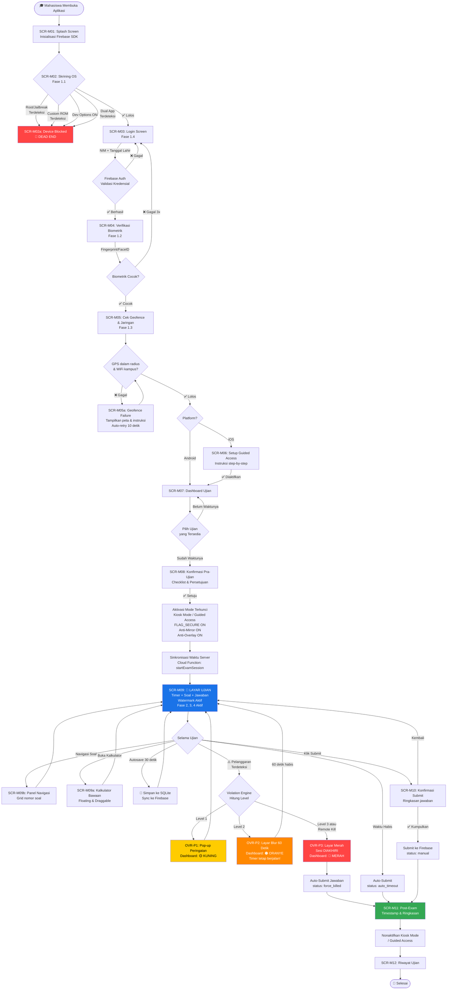
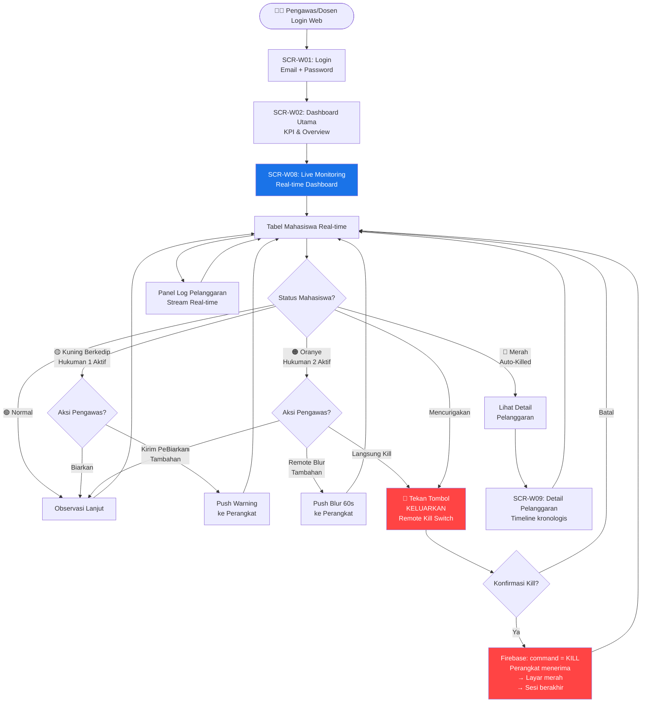
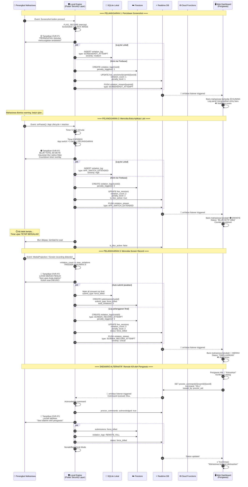

# 🏛️ CETAK BIRU ARSITEKTUR SISTEM — APLIKASI UAS FEB UNSAP

> **Versi**: 1.0.0 | **Tanggal**: 14 Juni 2026
> **Stack**: Flutter (Mobile) · Web Admin Panel · Firebase (Backend)
> **Acuan Utama**: Dokumen "KONSEP KEAMANAN APK UAS" — 5 Fase Keamanan

---

## DAFTAR ISI

1. [Arsitektur Informasi & Screen Mapping (UI Flow)](#1-arsitektur-informasi--screen-mapping-ui-flow)
2. [Skema Basis Data Firebase Firestore](#2-skema-basis-data-firebase-firestore)
3. [Core Exam Engine & Offline-First Architecture](#3-core-exam-engine--offline-first-architecture)
4. [Diagram Alur Sistem (System Diagrams)](#4-diagram-alur-sistem)

---

# 1. ARSITEKTUR INFORMASI & SCREEN MAPPING (UI FLOW)

## 1.1 Aplikasi Mobile — Mahasiswa (Flutter: Android & iOS)

Seluruh alur halaman mahasiswa dirancang untuk mencerminkan **5 Fase Keamanan** secara berurutan. Mahasiswa tidak akan pernah melihat soal ujian sampai seluruh gerbang keamanan dilewati.

### 📱 Peta Layar (Screen Map) — Alur Kronologis

| No | ID Layar | Nama Layar | Fase Keamanan | Deskripsi Fungsi |
|----|----------|------------|---------------|------------------|
| 1 | `SCR-M01` | **Splash Screen** | — | Logo FEB UNSAP + animasi loading. Background: inisialisasi SDK Firebase, pre-check koneksi. |
| 2 | `SCR-M02` | **OS Integrity Gate** | Fase 1.1 | Layar skrining otomatis. Menjalankan deteksi Root/Jailbreak, Custom ROM, Developer Options, USB Debugging, dan Dual Apps. Jika gagal → `SCR-M02a` (Blocked Screen). |
| 3 | `SCR-M02a` | **Device Blocked Screen** | Fase 1.1 | Layar merah penuh. Pesan: "Perangkat Anda terdeteksi tidak aman. Hubungi pengawas." Tidak ada tombol navigasi. Dead-end. |
| 4 | `SCR-M03` | **Login Screen** | Fase 1.4 | Input: NIM (username) + Tanggal Lahir (password). Tombol "Masuk". Link bantuan. |
| 5 | `SCR-M04` | **Biometric Verification** | Fase 1.2 | Prompt Fingerprint (Android) / Face ID / Touch ID (iOS). Wajib cocok dengan biometrik terdaftar di perangkat. Jika gagal 3x → kembali ke `SCR-M03`. |
| 6 | `SCR-M05` | **Geofence & Network Check** | Fase 1.3 | Layar validasi GPS + koneksi jaringan kampus. Animasi radar. Status: ✅ GPS Valid / ❌ Di Luar Radius. ✅ Jaringan Kampus / ❌ Jaringan Tidak Dikenal. Tombol "Lanjutkan" hanya muncul jika keduanya ✅. |
| 7 | `SCR-M05a` | **Geofence Failure** | Fase 1.3 | Peta mini menampilkan posisi mahasiswa vs radius FEB UNSAP. Instruksi untuk berpindah lokasi. Auto-retry setiap 10 detik. |
| 8 | `SCR-M06` | **Guided Access Setup (iOS Only)** | Fase 3 | Instruksi step-by-step visual (screenshot/animasi) cara mengaktifkan Guided Access di Settings iPhone. Tombol "Saya Sudah Mengaktifkan" → sistem verifikasi. |
| 9 | `SCR-M07` | **Dashboard Ujian** | — | Daftar mata kuliah ujian hari ini (kartu). Setiap kartu: Nama MK, Waktu Mulai, Durasi, Status (Belum Dimulai / Berlangsung / Selesai). Tombol "Mulai Ujian" (hanya aktif jika jadwal sudah masuk & semua Fase 1 lolos). |
| 10 | `SCR-M08` | **Pre-Exam Confirmation** | Fase 2 & 3 | Modal konfirmasi: "Anda akan memasuki mode ujian terkunci. Pastikan baterai cukup. Anda tidak akan bisa keluar sampai ujian selesai." Checkbox persetujuan + Tombol "Masuk Ujian". Saat tombol ditekan → Kiosk Mode diaktifkan (Android) / Guided Access diverifikasi (iOS). |
| 11 | `SCR-M09` | **Exam Screen (Layar Ujian Utama)** | Fase 2, 3, 4 | **Ini adalah layar inti.** Komponen: |
| | | | | — **Header**: Timer countdown (sinkron server), Nama MK, Nomor Soal (X/Total). |
| | | | | — **Body**: Teks soal (read-only, non-selectable) + Kolom jawaban esai (keyboard native, clipboard diblokir). |
| | | | | — **Footer**: Tombol Navigasi Soal (Prev/Next), Tombol "Tandai Soal", Tombol Kalkulator (floating). |
| | | | | — **Overlay Permanen**: Watermark dinamis (Nama + NIM + Tanggal) transparan di seluruh layar. |
| | | | | — **FLAG_SECURE aktif** (Android) / **isSecureTextEntry wrapper aktif** (iOS). |
| | | | | — Anti-mirroring, anti-overlay, anti-split-screen berjalan di background. |
| 12 | `SCR-M09a` | **Built-in Calculator (Overlay)** | Fase 4.9 | Kalkulator ilmiah floating (draggable). Bisa diminimalkan. Operasi: +, -, ×, ÷, √, %, pangkat, trigonometri. |
| 13 | `SCR-M09b` | **Soal Navigation Panel (Overlay)** | — | Grid nomor soal (1-N). Warna: Hijau (terjawab), Kuning (ditandai), Abu-abu (belum dijawab). Tap untuk lompat ke soal tertentu. |
| 14 | `SCR-M10` | **Submit Confirmation** | — | Modal: "Anda yakin ingin mengumpulkan? X soal belum dijawab." Ringkasan jawaban. Tombol "Kumpulkan Sekarang" + "Kembali ke Soal". |
| 15 | `SCR-M11` | **Post-Exam Screen** | — | Pesan sukses. Timestamp pengumpulan. Ringkasan: Total soal terjawab, total pelanggaran selama ujian. Tombol "Keluar" (menonaktifkan Kiosk Mode / Guided Access). |
| 16 | `SCR-M12` | **Riwayat Ujian** | — | List ujian yang sudah diikuti. Status: Terkumpul / Dibatalkan Sistem. Timestamp. Jumlah pelanggaran per ujian. |

### ⚠️ Overlay & State Penalti (Berjalan di Atas `SCR-M09`)

| ID Overlay | Nama | Pemicu | Behavior |
|------------|------|--------|----------|
| `OVR-P1` | **Warning Popup** | Hukuman 1: Deteksi pelanggaran pertama (screenshot attempt, app switch < 5 detik) | Pop-up merah full-width: "⚠️ PERINGATAN: Aktivitas mencurigakan terdeteksi! Pelanggaran Anda dicatat." Tombol "Saya Mengerti" (dismiss). Durasi auto-dismiss: 10 detik. Nama mahasiswa di dashboard pengawas berkedip **KUNING**. |
| `OVR-P2` | **Blur Punishment Screen** | Hukuman 2: Pelanggaran kedua terdeteksi | Seluruh `SCR-M09` di-blur total (Gaussian blur radius 50px). Timer overlay: countdown 60 detik. Teks: "Layar dikunci selama 60 detik sebagai sanksi pelanggaran." Mahasiswa tidak bisa berinteraksi dengan soal. Nama di dashboard berubah **ORANYE**. |
| `OVR-P3` | **Kill Switch / Red Screen** | Hukuman 3: Pelanggaran batas maksimal ATAU remote kill dari pengawas | Seluruh layar berubah **MERAH**. Teks: "Sesi ujian Anda telah diakhiri karena pelanggaran berulang." Kolom esai dikunci permanen. Tidak ada tombol navigasi. Status di dashboard: **MERAH** (Dikeluarkan). |
| `OVR-N1` | **Network Loss Banner** | Koneksi internet terputus | Banner kuning di atas: "Koneksi terputus. Jawaban disimpan offline. Sinkronisasi otomatis saat koneksi pulih." Indikator sinkronisasi (ikon cloud + centang/silang). |
| `OVR-N2` | **Autosave Indicator** | Setiap autosave berhasil | Toast kecil di pojok kanan bawah: "💾 Tersimpan" (fade out 2 detik). |

---

## 1.2 Web Admin Panel — Dosen & Pengawas

### 🖥️ Peta Layar (Screen Map)

| No | ID Layar | Nama Layar | Role Akses | Deskripsi Fungsi & Komponen |
|----|----------|------------|------------|----------------------------|
| 1 | `SCR-W01` | **Login Page** | Semua | Input: Email institusi + Password. Tombol Login. |
| 2 | `SCR-W02` | **Dashboard Utama** | Semua | KPI Cards: Total Ujian Aktif, Total Mahasiswa Online, Total Pelanggaran Hari Ini, Rata-rata Skor. Grafik tren pelanggaran (line chart). Quick links ke modul. |
| 3 | `SCR-W03` | **Manajemen Mata Kuliah** | Admin, Dosen | CRUD Mata Kuliah. Fields: Kode MK, Nama MK, SKS, Semester, Dosen Pengampu. Tabel data dengan search, filter, sort, pagination. |
| 4 | `SCR-W04` | **Manajemen Mahasiswa** | Admin | Import data mahasiswa (CSV/Excel). Tabel: NIM, Nama, Prodi, Semester, Status Aktif. Tombol registrasi individual. Reset password. |
| 5 | `SCR-W05` | **Bank Soal** | Dosen | CRUD soal per mata kuliah. Editor rich-text untuk soal esai/uraian. Upload gambar pendukung soal. Kategori soal: Esai, Uraian, Analisis, Perhitungan. Point/bobot per soal. Preview soal. |
| 6 | `SCR-W06` | **Buat/Edit Ujian** | Dosen | Form: Pilih MK, Judul Ujian, Tanggal & Jam Mulai, Durasi (menit), Pilih soal dari Bank Soal (drag & reorder), Radius Geofence (default: kampus FEB UNSAP), Toleransi pelanggaran (default: 3). Tombol "Publikasikan" / "Simpan Draft". |
| 7 | `SCR-W07` | **Jadwal Ujian** | Semua | Kalender interaktif (bulanan/mingguan). Klik tanggal → list ujian hari itu. Status ujian: Draft, Terjadwal, Berlangsung, Selesai. |
| 8 | `SCR-W08` | **🔴 Live Monitoring Dashboard** | Pengawas, Dosen | **Layar paling kritis.** Real-time via Firebase Realtime DB / Firestore Listeners. |
| | | | | **Komponen Utama:** |
| | | | | — **Tabel Mahasiswa Real-time**: Kolom: NIM, Nama, Status (Online/Offline/Dikeluarkan), Progress (X/Y soal), Jumlah Pelanggaran, Level Hukuman Saat Ini, Aksi. |
| | | | | — **Kode Warna Baris**: 🟢 Hijau = Normal, 🟡 Kuning Berkedip = Hukuman 1, 🟠 Oranye = Hukuman 2 (Blur aktif), 🔴 Merah = Hukuman 3 (Dikeluarkan). |
| | | | | — **Tombol Aksi per Mahasiswa**: "Kirim Peringatan" (push warning popup), "Blur Layar" (remote blur 60 detik), **"🔴 Keluarkan" (Remote Kill Switch)**. |
| | | | | — **Panel Log Pelanggaran Real-time** (sidebar): Stream kronologis pelanggaran dengan timestamp, jenis, dan severity. |
| | | | | — **Counter Statistik Live**: Online, Offline, Pelanggaran, Sudah Submit. |
| 9 | `SCR-W09` | **Detail Pelanggaran Mahasiswa** | Pengawas, Dosen | Profil mahasiswa + Timeline pelanggaran (kronologis). Setiap entry: Timestamp, Jenis Pelanggaran, Platform (Android/iOS), Severity Level, Screenshot flag status, Aksi yang diambil sistem. |
| 10 | `SCR-W10` | **Penilaian & Koreksi** | Dosen | List submissions per ujian. Klik mahasiswa → jawaban esai per soal ditampilkan. Input nilai per soal + komentar. Auto-calculate total skor. Tombol "Simpan Nilai" + "Finalisasi". |
| 11 | `SCR-W11` | **Rekapitulasi Nilai** | Dosen, Admin | Tabel nilai per MK. Filter: Semester, MK, Prodi. Export ke Excel/PDF. Statistik: Mean, Median, Distribusi nilai (bar chart). |
| 12 | `SCR-W12` | **Laporan Integritas Ujian** | Admin | Aggregasi pelanggaran per ujian, per mahasiswa, per jenis pelanggaran. Tren pelanggaran lintas semester. Daftar mahasiswa dengan riwayat pelanggaran berulang (flagged students). |
| 13 | `SCR-W13` | **Pengaturan Sistem** | Admin | Konfigurasi geofence (koordinat pusat + radius). Konfigurasi batas pelanggaran. Konfigurasi durasi blur penalty. Manajemen akun admin/dosen/pengawas (CRUD). Konfigurasi jaringan kampus yang diizinkan (SSID/IP range). |
| 14 | `SCR-W14` | **Profil & Keamanan** | Semua | Edit profil, ubah password, aktifkan 2FA untuk akun admin/dosen. Log aktivitas akun. |

### 🔐 Matriks Hak Akses (RBAC)

| Fitur | Super Admin | Dosen | Pengawas |
|-------|:-----------:|:-----:|:--------:|
| Manajemen Mahasiswa | ✅ | ❌ | ❌ |
| Manajemen Mata Kuliah | ✅ | ✅ (miliknya) | ❌ |
| Bank Soal & Buat Ujian | ✅ | ✅ (miliknya) | ❌ |
| Live Monitoring | ✅ | ✅ | ✅ |
| Remote Kill Switch | ✅ | ✅ | ✅ |
| Penilaian & Koreksi | ✅ | ✅ (miliknya) | ❌ |
| Rekap Nilai & Export | ✅ | ✅ (miliknya) | ❌ |
| Laporan Integritas | ✅ | ✅ | ✅ (view only) |
| Pengaturan Sistem | ✅ | ❌ | ❌ |

---

# 2. SKEMA BASIS DATA FIREBASE FIRESTORE

> [!IMPORTANT]
> Firestore digunakan untuk data persisten. **Firebase Realtime Database** digunakan secara paralel hanya untuk data yang membutuhkan latensi ultra-rendah (live monitoring status mahasiswa, stream pelanggaran real-time). Kedua database saling sinkron melalui Cloud Functions.

## 2.1 Arsitektur Koleksi Tingkat Atas

```
firestore-root/
├── 📁 users/                    # Semua pengguna (mahasiswa, dosen, admin, pengawas)
├── 📁 courses/                  # Mata kuliah
├── 📁 question_banks/           # Bank soal per mata kuliah
├── 📁 exams/                    # Konfigurasi ujian
│   └── 📁 {examId}/
│       └── 📁 questions/        # Sub-koleksi: soal dalam ujian
├── 📁 exam_sessions/            # Sesi ujian aktif per mahasiswa
├── 📁 submissions/              # Jawaban final mahasiswa
│   └── 📁 {submissionId}/
│       └── 📁 answers/          # Sub-koleksi: jawaban per soal
├── 📁 violation_logs/           # Log pelanggaran (append-only)
├── 📁 device_registry/          # Registrasi perangkat mahasiswa
├── 📁 geofence_config/          # Konfigurasi geofence
└── 📁 system_config/            # Konfigurasi sistem global
```

---

## 2.2 Detail Skema Per Koleksi

### 📁 `users` — Koleksi Pengguna

```
users/{userId}
```

| Field | Tipe | Deskripsi | Contoh |
|-------|------|-----------|--------|
| `uid` | `string` | Firebase Auth UID | `"abc123xyz"` |
| `role` | `string` | Enum: `mahasiswa`, `dosen`, `pengawas`, `admin` | `"mahasiswa"` |
| `nim` | `string` | Nomor Induk Mahasiswa (hanya role mahasiswa) | `"2024010001"` |
| `full_name` | `string` | Nama lengkap | `"Ahmad Fauzi"` |
| `email` | `string` | Email institusi | `"ahmad@feb.unsap.ac.id"` |
| `date_of_birth` | `timestamp` | Tanggal lahir (sebagai password mahasiswa) | `2003-05-15T00:00:00Z` |
| `prodi` | `string` | Program studi | `"Akuntansi"` |
| `semester` | `number` | Semester aktif | `4` |
| `is_active` | `boolean` | Status aktif | `true` |
| `biometric_registered` | `boolean` | Apakah biometrik sudah didaftarkan di perangkat | `true` |
| `registered_device_id` | `string` | ID perangkat terdaftar (1 mahasiswa = 1 device) | `"dev_xyz789"` |
| `flagged` | `boolean` | Mahasiswa yang di-flag karena riwayat pelanggaran | `false` |
| `total_violations_alltime` | `number` | Total pelanggaran sepanjang waktu | `2` |
| `created_at` | `timestamp` | Waktu registrasi | `2026-01-15T08:00:00Z` |
| `updated_at` | `timestamp` | Waktu update terakhir | `2026-06-10T10:30:00Z` |

**Indexes yang dibutuhkan:**
- Composite: `role` + `prodi` + `semester`
- Single: `nim` (unique constraint via Cloud Function)
- Single: `email`

---

### 📁 `courses` — Koleksi Mata Kuliah

```
courses/{courseId}
```

| Field | Tipe | Deskripsi | Contoh |
|-------|------|-----------|--------|
| `course_code` | `string` | Kode mata kuliah | `"AKT301"` |
| `course_name` | `string` | Nama mata kuliah | `"Akuntansi Manajemen"` |
| `sks` | `number` | Jumlah SKS | `3` |
| `semester` | `number` | Semester MK | `5` |
| `prodi` | `string` | Program studi | `"Akuntansi"` |
| `lecturer_uid` | `string` | UID dosen pengampu | `"dosen_uid_001"` |
| `lecturer_name` | `string` | Nama dosen (denormalisasi untuk query cepat) | `"Dr. Siti Aminah"` |
| `enrolled_students` | `array<string>` | Array UID mahasiswa terdaftar | `["uid1", "uid2", ...]` |
| `created_at` | `timestamp` | | |
| `updated_at` | `timestamp` | | |

---

### 📁 `question_banks` — Bank Soal

```
question_banks/{questionBankId}
```

| Field | Tipe | Deskripsi | Contoh |
|-------|------|-----------|--------|
| `course_id` | `string` | Reference ke `courses` | `"course_akt301"` |
| `created_by` | `string` | UID dosen pembuat | `"dosen_uid_001"` |
| `question_text` | `string` | Teks soal (rich text / HTML sanitized) | `"Jelaskan konsep..."` |
| `question_type` | `string` | Enum: `esai`, `uraian`, `analisis`, `perhitungan` | `"esai"` |
| `question_images` | `array<string>` | URL gambar pendukung soal (Firebase Storage) | `["gs://bucket/img1.png"]` |
| `max_score` | `number` | Bobot nilai maksimal soal | `25` |
| `rubric_guide` | `string` | Panduan penilaian untuk dosen | `"Minimal 3 poin..."` |
| `difficulty` | `string` | Enum: `mudah`, `sedang`, `sulit` | `"sedang"` |
| `tags` | `array<string>` | Tag/kategori soal | `["bab-5", "teori"]` |
| `is_active` | `boolean` | Apakah soal aktif | `true` |
| `created_at` | `timestamp` | | |
| `updated_at` | `timestamp` | | |

---

### 📁 `exams` — Konfigurasi Ujian

```
exams/{examId}
```

| Field | Tipe | Deskripsi | Contoh |
|-------|------|-----------|--------|
| `exam_title` | `string` | Judul ujian | `"UAS Akuntansi Manajemen 2026"` |
| `course_id` | `string` | Reference ke `courses` | `"course_akt301"` |
| `course_code` | `string` | Denormalisasi kode MK | `"AKT301"` |
| `course_name` | `string` | Denormalisasi nama MK | `"Akuntansi Manajemen"` |
| `created_by` | `string` | UID dosen pembuat | `"dosen_uid_001"` |
| `exam_date` | `timestamp` | Tanggal & jam mulai ujian | `2026-07-15T08:00:00Z` |
| `duration_minutes` | `number` | Durasi ujian dalam menit | `120` |
| `end_time` | `timestamp` | Waktu berakhir (computed) | `2026-07-15T10:00:00Z` |
| `status` | `string` | Enum: `draft`, `scheduled`, `live`, `completed`, `cancelled` | `"scheduled"` |
| `total_questions` | `number` | Jumlah soal | `5` |
| `total_max_score` | `number` | Total skor maksimal | `100` |
| `geofence_center_lat` | `number` | Latitude pusat geofence | `-6.8735` |
| `geofence_center_lng` | `number` | Longitude pusat geofence | `107.5425` |
| `geofence_radius_meters` | `number` | Radius geofence (meter) | `200` |
| `allowed_network_ssids` | `array<string>` | SSID Wi-Fi kampus yang diizinkan | `["FEB-UNSAP", "UNSAP-NET"]` |
| `max_violations` | `number` | Batas pelanggaran sebelum auto-kill (Hukuman 3) | `3` |
| `blur_penalty_seconds` | `number` | Durasi blur Hukuman 2 (detik) | `60` |
| `eligible_students` | `array<string>` | Array UID mahasiswa yang berhak ikut ujian | `["uid1", "uid2"]` |
| `question_order` | `array<string>` | Array `questionBankId` dalam urutan tampil | `["qb_01", "qb_05", "qb_03"]` |
| `shuffle_questions` | `boolean` | Acak urutan soal per mahasiswa | `true` |
| `created_at` | `timestamp` | | |
| `updated_at` | `timestamp` | | |

**Sub-koleksi `exams/{examId}/questions/{orderIndex}`:**

| Field | Tipe | Deskripsi |
|-------|------|-----------|
| `question_bank_ref` | `string` | Reference ke `question_banks/{id}` |
| `order_index` | `number` | Urutan soal dalam ujian (0-based) |
| `question_text` | `string` | Snapshot teks soal (frozen saat ujian dipublikasi) |
| `question_images` | `array<string>` | Snapshot gambar soal |
| `question_type` | `string` | Tipe soal |
| `max_score` | `number` | Bobot soal |

> [!NOTE]
> Soal di-**snapshot** (disalin) ke sub-koleksi saat ujian dipublikasi. Ini mencegah perubahan bank soal setelah ujian dijadwalkan memengaruhi soal yang sudah keluar.

---

### 📁 `exam_sessions` — Sesi Ujian Aktif

> Dokumen ini dibuat saat mahasiswa menekan "Mulai Ujian" dan dihapus/diarsipkan setelah submit. **Koleksi ini adalah sumber kebenaran untuk Live Monitoring Dashboard.**

```
exam_sessions/{sessionId}
```

| Field | Tipe | Deskripsi | Contoh |
|-------|------|-----------|--------|
| `session_id` | `string` | UUID sesi | `"ses_abc123"` |
| `exam_id` | `string` | Reference ke `exams` | `"exam_akt301_2026"` |
| `student_uid` | `string` | UID mahasiswa | `"std_uid_001"` |
| `student_nim` | `string` | NIM (denormalisasi) | `"2024010001"` |
| `student_name` | `string` | Nama (denormalisasi) | `"Ahmad Fauzi"` |
| `device_id` | `string` | ID perangkat yang digunakan | `"dev_xyz789"` |
| `device_platform` | `string` | Enum: `android`, `ios` | `"android"` |
| `device_model` | `string` | Model perangkat | `"Samsung Galaxy A54"` |
| `os_version` | `string` | Versi OS | `"Android 14"` |
| `started_at` | `timestamp` | Waktu mulai ujian (server time) | `2026-07-15T08:01:30Z` |
| `server_start_epoch_ms` | `number` | Epoch ms dari server saat mulai | `1752566490000` |
| `expected_end_at` | `timestamp` | Waktu berakhir yang diharapkan | `2026-07-15T10:01:30Z` |
| `status` | `string` | Enum: `active`, `submitted`, `force_killed`, `expired`, `disconnected` | `"active"` |
| `connection_status` | `string` | Enum: `online`, `offline` | `"online"` |
| `last_heartbeat` | `timestamp` | Heartbeat terakhir dari perangkat | `2026-07-15T09:15:00Z` |
| `progress_answered` | `number` | Jumlah soal yang sudah dijawab | `3` |
| `progress_total` | `number` | Total soal | `5` |
| `progress_marked` | `number` | Jumlah soal yang ditandai | `1` |
| `current_question_index` | `number` | Soal yang sedang dikerjakan | `3` |
| `violation_count` | `number` | Total pelanggaran dalam sesi ini | `1` |
| `current_penalty_level` | `number` | Level hukuman saat ini (0, 1, 2, 3) | `1` |
| `is_blur_active` | `boolean` | Apakah blur penalty sedang aktif | `false` |
| `blur_end_time` | `timestamp` | Waktu blur berakhir (jika aktif) | `null` |
| `is_killed` | `boolean` | Apakah sesi sudah di-kill | `false` |
| `killed_by` | `string` | UID pengawas yang meng-kill (jika remote kill) | `null` |
| `killed_reason` | `string` | Alasan kill | `null` |
| `gps_lat` | `number` | Latitude terakhir | `-6.8736` |
| `gps_lng` | `number` | Longitude terakhir | `107.5424` |
| `last_autosave_at` | `timestamp` | Waktu autosave terakhir | `2026-07-15T09:14:55Z` |
| `ip_address` | `string` | IP address mahasiswa | `"192.168.1.105"` |

> [!TIP]
> Untuk optimasi biaya Firestore reads, field yang sering berubah (`last_heartbeat`, `connection_status`, `progress_answered`, `current_question_index`) juga dimirror ke **Firebase Realtime Database** di path `live_sessions/{examId}/{sessionId}` agar dashboard pengawas bisa listen tanpa biaya per-read yang mahal.

---

### 📁 `submissions` — Jawaban Final Mahasiswa

```
submissions/{submissionId}
```

| Field | Tipe | Deskripsi | Contoh |
|-------|------|-----------|--------|
| `submission_id` | `string` | UUID submission | `"sub_def456"` |
| `exam_id` | `string` | Reference ke `exams` | `"exam_akt301_2026"` |
| `session_id` | `string` | Reference ke `exam_sessions` | `"ses_abc123"` |
| `student_uid` | `string` | UID mahasiswa | `"std_uid_001"` |
| `student_nim` | `string` | NIM | `"2024010001"` |
| `student_name` | `string` | Nama | `"Ahmad Fauzi"` |
| `course_id` | `string` | Reference ke `courses` | `"course_akt301"` |
| `submitted_at` | `timestamp` | Waktu submit | `2026-07-15T09:58:00Z` |
| `submit_type` | `string` | Enum: `manual` (mahasiswa), `auto_timeout`, `force_killed` | `"manual"` |
| `total_violations` | `number` | Total pelanggaran selama ujian | `1` |
| `final_penalty_level` | `number` | Level hukuman terakhir | `1` |
| `total_score` | `number` | Total nilai (diisi dosen saat koreksi) | `null` → `78` |
| `grading_status` | `string` | Enum: `pending`, `in_progress`, `graded`, `finalized` | `"pending"` |
| `graded_by` | `string` | UID dosen yang menilai | `null` |
| `graded_at` | `timestamp` | Waktu penilaian | `null` |
| `grading_notes` | `string` | Catatan umum dosen | `null` |
| `integrity_flag` | `string` | Enum: `clean`, `warning`, `suspicious` | `"warning"` |
| `created_at` | `timestamp` | | |

**Sub-koleksi `submissions/{submissionId}/answers/{questionIndex}`:**

| Field | Tipe | Deskripsi | Contoh |
|-------|------|-----------|--------|
| `question_index` | `number` | Urutan soal | `0` |
| `question_ref` | `string` | Ref ke soal di exam | `"exams/exam_001/questions/0"` |
| `question_text_snapshot` | `string` | Snapshot teks soal | `"Jelaskan konsep..."` |
| `answer_text` | `string` | Jawaban esai mahasiswa | `"Menurut teori..."` |
| `answer_length` | `number` | Panjang jawaban (karakter) | `1250` |
| `word_count` | `number` | Jumlah kata | `210` |
| `is_marked` | `boolean` | Apakah soal ditandai mahasiswa | `false` |
| `time_spent_seconds` | `number` | Total waktu di soal ini (akumulatif) | `840` |
| `first_answered_at` | `timestamp` | Waktu pertama mulai menjawab | `2026-07-15T08:05:00Z` |
| `last_edited_at` | `timestamp` | Waktu edit terakhir | `2026-07-15T09:30:00Z` |
| `edit_count` | `number` | Berapa kali diedit | `5` |
| `typing_anomaly_detected` | `boolean` | Apakah ada anomali kecepatan input | `false` |
| `score` | `number` | Nilai per soal (diisi dosen) | `null` → `20` |
| `feedback` | `string` | Komentar dosen per soal | `null` |

---

### 📁 `violation_logs` — Log Pelanggaran (Append-Only)

> [!CAUTION]
> Koleksi ini bersifat **append-only** dan **immutable**. Tidak ada operasi update atau delete yang diizinkan. Ini adalah audit trail yang tidak bisa dimanipulasi. Firestore Security Rules wajib melarang update/delete.

```
violation_logs/{violationId}
```

| Field | Tipe | Deskripsi | Contoh |
|-------|------|-----------|--------|
| `violation_id` | `string` | UUID pelanggaran | `"vio_ghi789"` |
| `exam_id` | `string` | Reference ke `exams` | `"exam_akt301_2026"` |
| `session_id` | `string` | Reference ke `exam_sessions` | `"ses_abc123"` |
| `student_uid` | `string` | UID mahasiswa | `"std_uid_001"` |
| `student_nim` | `string` | NIM (denormalisasi) | `"2024010001"` |
| `student_name` | `string` | Nama (denormalisasi) | `"Ahmad Fauzi"` |
| `violation_type` | `string` | Kode jenis pelanggaran (lihat tabel di bawah) | `"SCREENSHOT_ATTEMPT"` |
| `violation_category` | `string` | Enum: `screen_capture`, `app_switch`, `input_anomaly`, `network`, `device_tampering`, `geofence` | `"screen_capture"` |
| `platform` | `string` | Enum: `android`, `ios` | `"android"` |
| `severity` | `string` | Enum: `low`, `medium`, `high`, `critical` | `"medium"` |
| `penalty_triggered` | `number` | Hukuman yang dipicu (1, 2, atau 3) | `1` |
| `description` | `string` | Deskripsi detail otomatis | `"Percobaan screenshot terdeteksi via FLAG_SECURE callback"` |
| `device_state` | `map` | Snapshot kondisi perangkat saat pelanggaran | `{ battery: 75, gps_lat: -6.87, gps_lng: 107.54, network: "wifi", app_foreground: true }` |
| `metadata` | `map` | Data tambahan spesifik per jenis pelanggaran | `{ blocked_app: "com.screen.recorder", method: "MediaProjection" }` |
| `auto_action_taken` | `string` | Aksi otomatis yang diambil sistem | `"WARNING_POPUP_SHOWN"` |
| `resolved_by` | `string` | UID pengawas yang menangani (jika ada) | `null` |
| `resolution_notes` | `string` | Catatan resolusi pengawas | `null` |
| `timestamp` | `timestamp` | Waktu pelanggaran (server time) | `2026-07-15T09:10:15Z` |
| `client_timestamp` | `timestamp` | Waktu di perangkat mahasiswa | `2026-07-15T09:10:14Z` |

#### Tabel Kode Jenis Pelanggaran (`violation_type`)

| Kode | Kategori | Severity | Fase | Deskripsi |
|------|----------|----------|------|-----------|
| `SCREENSHOT_ATTEMPT` | `screen_capture` | `medium` | 2 | Percobaan screenshot |
| `SCREEN_RECORD_ATTEMPT` | `screen_capture` | `high` | 2 | Percobaan screen recording |
| `MIRROR_ATTEMPT` | `screen_capture` | `high` | 2 | Percobaan casting/AirPlay/Chromecast/HDMI |
| `APP_SWITCH_BRIEF` | `app_switch` | `low` | 3 | App switch < 5 detik (kembali cepat) |
| `APP_SWITCH_EXTENDED` | `app_switch` | `high` | 3 | App switch > 5 detik |
| `KIOSK_MODE_DISABLED` | `app_switch` | `critical` | 3 | Kiosk mode dimatikan paksa (Android) |
| `GUIDED_ACCESS_EXIT` | `app_switch` | `critical` | 3 | Guided Access dimatikan (iOS) |
| `SPLIT_SCREEN_ATTEMPT` | `app_switch` | `high` | 3 | Percobaan split screen/PiP |
| `OVERLAY_DETECTED` | `app_switch` | `medium` | 3 | Overlay/floating app terdeteksi |
| `CONTROL_CENTER_LONG` | `app_switch` | `high` | 3 | Control Center dibuka > 5 detik (iOS) |
| `TAPJACKING_DETECTED` | `app_switch` | `high` | 3 | Touch saat layar obscured (Android) |
| `CLIPBOARD_PASTE` | `input_anomaly` | `medium` | 4 | Percobaan paste dari clipboard |
| `TYPING_SPEED_ANOMALY` | `input_anomaly` | `high` | 4 | Kecepatan input tidak wajar (bulk paste) |
| `TEXT_SELECTION_ATTEMPT` | `input_anomaly` | `low` | 4 | Percobaan seleksi teks soal |
| `GPS_OUT_OF_RANGE` | `geofence` | `critical` | 1 | GPS keluar radius geofence saat ujian |
| `NETWORK_CHANGE` | `network` | `low` | 1 | Perpindahan jaringan terdeteksi |
| `ROOT_DETECTED_RUNTIME` | `device_tampering` | `critical` | 1 | Root/jailbreak terdeteksi saat runtime |
| `DEVELOPER_OPTIONS_ON` | `device_tampering` | `high` | 1 | Developer options dinyalakan saat ujian |
| `REMOTE_KILL_BY_PROCTOR` | `admin_action` | `critical` | 5 | Pengawas menekan tombol "Keluarkan" |
| `REMOTE_BLUR_BY_PROCTOR` | `admin_action` | `high` | 5 | Pengawas menekan tombol "Blur Layar" |
| `REMOTE_WARNING_BY_PROCTOR` | `admin_action` | `medium` | 5 | Pengawas mengirim peringatan manual |

---

### 📁 `device_registry` — Registrasi Perangkat

```
device_registry/{deviceId}
```

| Field | Tipe | Deskripsi |
|-------|------|-----------|
| `device_id` | `string` | Unique device fingerprint |
| `student_uid` | `string` | UID mahasiswa pemilik |
| `platform` | `string` | `android` / `ios` |
| `device_model` | `string` | Model perangkat |
| `os_version` | `string` | Versi OS |
| `app_version` | `string` | Versi aplikasi UAS |
| `firebase_token` | `string` | FCM token untuk push notification |
| `biometric_capability` | `string` | `fingerprint`, `face_id`, `touch_id`, `none` |
| `first_registered_at` | `timestamp` | Pertama kali registrasi |
| `last_active_at` | `timestamp` | Terakhir digunakan |
| `is_blocked` | `boolean` | Apakah perangkat diblokir admin |
| `blocked_reason` | `string` | Alasan diblokir |

---

### 📁 `geofence_config` & `system_config` — Konfigurasi Sistem

```
geofence_config/default
```

| Field | Tipe | Deskripsi | Default |
|-------|------|-----------|---------|
| `center_latitude` | `number` | Lat pusat kampus FEB UNSAP | `-6.8735` |
| `center_longitude` | `number` | Lng pusat kampus FEB UNSAP | `107.5425` |
| `radius_meters` | `number` | Radius dalam meter | `200` |
| `allowed_ssids` | `array<string>` | SSID WiFi kampus | `["FEB-UNSAP"]` |
| `allowed_ip_ranges` | `array<string>` | Range IP kampus | `["192.168.1.0/24"]` |

```
system_config/global
```

| Field | Tipe | Deskripsi | Default |
|-------|------|-----------|---------|
| `max_violations_default` | `number` | Batas pelanggaran default | `3` |
| `blur_duration_seconds` | `number` | Durasi blur default | `60` |
| `heartbeat_interval_seconds` | `number` | Interval heartbeat | `10` |
| `autosave_interval_seconds` | `number` | Interval autosave | `30` |
| `offline_tolerance_seconds` | `number` | Toleransi offline sebelum flagged | `60` |
| `typing_speed_threshold_cps` | `number` | Threshold karakter per detik (anomali) | `50` |
| `app_min_version_android` | `string` | Versi minimum APK | `"1.0.0"` |
| `app_min_version_ios` | `string` | Versi minimum iOS app | `"1.0.0"` |
| `maintenance_mode` | `boolean` | Mode maintenance | `false` |

---

### 🔄 Firebase Realtime Database — Mirror untuk Live Monitoring

> Struktur khusus untuk data real-time dengan latensi rendah (< 200ms):

```
realtime-db-root/
├── live_sessions/
│   └── {examId}/
│       └── {sessionId}/
│           ├── student_nim: "2024010001"
│           ├── student_name: "Ahmad Fauzi"
│           ├── status: "active"
│           ├── connection: "online"
│           ├── violation_count: 1
│           ├── penalty_level: 1
│           ├── progress: "3/5"
│           ├── is_blur_active: false
│           ├── last_heartbeat: 1752566100000
│           └── last_update: 1752566100000
├── violation_stream/
│   └── {examId}/
│       └── {auto-push-id}/
│           ├── student_nim: "2024010001"
│           ├── student_name: "Ahmad Fauzi"
│           ├── type: "SCREENSHOT_ATTEMPT"
│           ├── severity: "medium"
│           ├── penalty: 1
│           └── timestamp: 1752566115000
└── proctor_commands/
    └── {examId}/
        └── {sessionId}/
            ├── command: "BLUR" | "KILL" | "WARN" | null
            ├── issued_by: "proctor_uid"
            ├── issued_at: 1752566200000
            └── acknowledged: false
```

> [!IMPORTANT]
> **`proctor_commands`** adalah jalur komunikasi satu arah dari pengawas ke perangkat mahasiswa. Perangkat mahasiswa melakukan `listen` pada path ini dan langsung mengeksekusi perintah saat ada perubahan. Setelah dieksekusi, perangkat mengirim acknowledgment.

---

# 3. CORE EXAM ENGINE & OFFLINE-FIRST ARCHITECTURE

## 3.1 Arsitektur Offline-First & Autosave

### Prinsip Desain

Mengingat Wi-Fi kampus bisa tidak stabil, arsitektur ini memastikan **tidak ada satu kata pun jawaban mahasiswa yang hilang**, bahkan jika koneksi terputus selama ujian berlangsung.

### Diagram Arsitektur Penyimpanan

```
┌─────────────────────────────────────────────────────┐
│                 PERANGKAT MAHASISWA                  │
│                                                     │
│  ┌──────────┐    ┌──────────────┐    ┌───────────┐  │
│  │ UI Layer │───▶│  Exam Engine │───▶│ Local DB  │  │
│  │ (Flutter) │    │  Controller  │    │ (SQLite/  │  │
│  └──────────┘    └──────┬───────┘    │  Hive)    │  │
│                         │            └─────┬─────┘  │
│                         │                  │        │
│                  ┌──────▼───────┐    ┌─────▼─────┐  │
│                  │  Sync Queue  │    │  Offline   │  │
│                  │  Manager     │◀───│  Cache     │  │
│                  └──────┬───────┘    └───────────┘  │
│                         │                           │
└─────────────────────────┼───────────────────────────┘
                          │
              ┌───────────▼───────────┐
              │   NETWORK BOUNDARY    │
              │   (Wi-Fi Kampus)      │
              └───────────┬───────────┘
                          │
┌─────────────────────────▼───────────────────────────┐
│                    FIREBASE                          │
│                                                     │
│  ┌─────────────┐  ┌──────────────┐  ┌────────────┐ │
│  │  Firestore   │  │  Realtime DB │  │  Cloud     │ │
│  │  (Persistent)│  │  (Live Data) │  │  Functions │ │
│  └─────────────┘  └──────────────┘  └────────────┘ │
└─────────────────────────────────────────────────────┘
```

### Mekanisme Autosave Berkala

#### Layer 1: In-Memory Buffer (Real-time)
```
Setiap keystroke pada kolom jawaban esai:
├── Disimpan ke variabel state di memori (RAM)
├── Debounce 2 detik: setelah 2 detik tanpa ketikan baru
│   └── Trigger save ke Local DB
└── Jika user navigasi ke soal lain → force save ke Local DB
```

#### Layer 2: Local Database — SQLite via `sqflite` (Persistent)
```
Tabel: draft_answers
├── session_id     TEXT (PK bersama question_index)
├── question_index INTEGER (PK)
├── answer_text    TEXT (encrypted AES-256)
├── word_count     INTEGER
├── char_count     INTEGER
├── time_spent_ms  INTEGER (akumulatif)
├── is_marked      INTEGER (0/1)
├── updated_at     INTEGER (epoch ms)
├── sync_status    TEXT ('pending' | 'synced' | 'failed')
└── sync_version   INTEGER (optimistic locking counter)

Tabel: sync_queue
├── queue_id       TEXT (PK, UUID)
├── operation      TEXT ('SAVE_ANSWER' | 'LOG_VIOLATION' | 'HEARTBEAT')
├── payload        TEXT (JSON encrypted)
├── priority       INTEGER (1=highest, violation > answer > heartbeat)
├── created_at     INTEGER (epoch ms)
├── retry_count    INTEGER
├── max_retries    INTEGER (default: 10)
├── status         TEXT ('queued' | 'in_progress' | 'completed' | 'failed')
└── error_message  TEXT
```

#### Layer 3: Sync Queue Manager — Sinkronisasi ke Firebase

```
┌─────────────────────────────────────────────────────────────┐
│                  SYNC QUEUE MANAGER                          │
│                                                              │
│  ┌─────────┐    ┌──────────────┐    ┌──────────────────┐    │
│  │ Network │───▶│ Connectivity │───▶│ Batch Sync       │    │
│  │ Monitor │    │ Stream       │    │ Processor        │    │
│  └─────────┘    └──────────────┘    └────────┬─────────┘    │
│                                              │              │
│                                     ┌────────▼─────────┐    │
│                                     │ Priority Queue   │    │
│                                     │ 1. Violations    │    │
│                                     │ 2. Answers       │    │
│                                     │ 3. Heartbeats    │    │
│                                     └──────────────────┘    │
└─────────────────────────────────────────────────────────────┘
```

**Alur Sinkronisasi:**

1. **Timer Autosave** berjalan setiap **30 detik** (konfigurabel via `system_config`).
2. Setiap 30 detik:
   - Semua `draft_answers` dengan `sync_status = 'pending'` dimasukkan ke `sync_queue`.
   - Heartbeat (`last_alive` timestamp) ditambahkan ke `sync_queue`.
3. **Saat Online:**
   - `Sync Queue Manager` membaca antrian berdasarkan prioritas.
   - Violations dikirim pertama (paling kritis).
   - Jawaban dikirim batch (semua jawaban yang berubah sejak sync terakhir).
   - Heartbeat dikirim terakhir.
   - Setelah berhasil → `sync_status` diupdate ke `'synced'`.
   - Jika gagal → `retry_count++`, masuk antrian ulang dengan exponential backoff (2s, 4s, 8s, 16s, max 60s).
4. **Saat Offline:**
   - Semua operasi tetap masuk `sync_queue` di SQLite.
   - `Network Monitor` terus memantau koneksi via `connectivity_plus`.
   - Saat koneksi pulih → **flush seluruh antrian** secara berurutan.
   - Banner `OVR-N1` ditampilkan di UI.
5. **Saat Submit Ujian:**
   - Force sync seluruh jawaban yang belum synced.
   - Jika masih offline → jawaban disimpan lokal dengan flag `submit_pending`.
   - Saat online kembali → auto-submit dengan timestamp asli.

#### Conflict Resolution Strategy

```
Strategi: Last-Write-Wins + Server Timestamp

Jika jawaban dari perangkat A dan perangkat B (skenario tidak diizinkan, tapi
sebagai safety net) konflik:
├── Gunakan `sync_version` (optimistic locking)
├── Bandingkan `sync_version` perangkat vs server
├── Jika server_version > client_version:
│   └── Client harus re-fetch, gabungkan, dan re-submit
├── Jika client_version >= server_version:
│   └── Client wins, update server
└── Semua konflik dicatat di `violation_logs` sebagai anomali
```

> [!WARNING]
> Jawaban esai di SQLite lokal di-enkripsi menggunakan **AES-256-GCM**. Kunci enkripsi diturunkan dari kombinasi `session_id` + `device_id` + secret key yang di-fetch dari Firebase saat sesi dimulai. Ini mencegah jawaban bisa dibaca jika perangkat di-root setelah ujian.

---

## 3.2 Mekanisme Sinkronisasi Waktu (Timer Lifecycle)

### Masalah yang Diatasi

Mahasiswa bisa mengubah jam perangkat untuk mendapat waktu tambahan. Timer ujian **WAJIB** bersumber dari server, bukan perangkat.

### Arsitektur Timer

```
┌─────────────────────────────────────────────────────────────┐
│                    SERVER TIME ARCHITECTURE                   │
│                                                               │
│  ┌──────────────────────────────────────────────────────┐    │
│  │          Firebase Server Timestamp                     │    │
│  │          (Firestore.Timestamp.now())                   │    │
│  └─────────────────────┬────────────────────────────────┘    │
│                        │                                      │
│              ┌─────────▼──────────┐                          │
│              │ Cloud Function:    │                          │
│              │ getServerTime()    │ ◄── HTTPS Callable       │
│              │ Returns: epoch_ms  │                          │
│              └─────────┬──────────┘                          │
│                        │                                      │
└────────────────────────┼──────────────────────────────────────┘
                         │
              ┌──────────▼──────────┐
              │   PERANGKAT CLIENT   │
              │                     │
              │  ┌───────────────┐  │
              │  │ Time Sync     │  │
              │  │ Service       │  │
              │  └───────┬───────┘  │
              │          │          │
              │  ┌───────▼───────┐  │
              │  │ Exam Timer    │  │
              │  │ Controller    │  │
              │  └───────────────┘  │
              └─────────────────────┘
```

### Alur Sinkronisasi Waktu (Langkah demi Langkah)

#### Fase Inisialisasi (Saat "Mulai Ujian" Ditekan)

```
1. Client memanggil Cloud Function `startExamSession(examId, studentUid)`

2. Cloud Function melakukan:
   a. Validasi: mahasiswa eligible, exam sedang live, belum punya sesi aktif
   b. Ambil server_time = FieldValue.serverTimestamp()
   c. Hitung end_time = server_time + exam.duration_minutes * 60 * 1000
   d. Buat dokumen exam_session dengan:
      - server_start_epoch_ms: server_time (epoch ms)
      - expected_end_at: end_time
   e. Return ke client:
      {
        session_id: "ses_abc123",
        server_epoch_ms: 1752566490000,      // waktu server saat ini
        exam_end_epoch_ms: 1752573690000,     // waktu ujian berakhir
        duration_ms: 7200000                   // durasi total (ms)
      }

3. Client menghitung OFFSET:
   client_epoch_ms = DateTime.now().millisecondsSinceEpoch
   time_offset = server_epoch_ms - client_epoch_ms
   // Jika positif: jam client tertinggal
   // Jika negatif: jam client lebih maju
   // Offset ini disimpan dan digunakan untuk SEMUA perhitungan waktu
```

#### Fase Runtime (Selama Ujian Berlangsung)

```
TIMER TICK (setiap 1 detik):
├── current_server_time = DateTime.now().millisecondsSinceEpoch + time_offset
├── remaining_ms = exam_end_epoch_ms - current_server_time
├── IF remaining_ms <= 0:
│   └── AUTO-SUBMIT (waktu habis)
├── IF remaining_ms <= 300000 (5 menit):
│   └── Tampilkan peringatan "Waktu hampir habis!" + warna timer jadi MERAH
├── Display: format(remaining_ms) → "01:23:45"
└── Setiap 5 MENIT:
    └── RE-SYNC: panggil Cloud Function `getServerTime()`
        ├── Hitung ulang time_offset
        ├── Koreksi timer jika drift > 2 detik
        └── Jika drift > 30 detik → log sebagai anomali
            (kemungkinan mahasiswa mengubah jam perangkat)
```

#### Proteksi Anti-Manipulasi Waktu

```
DETEKSI MANIPULASI JAM PERANGKAT:

1. Monitor `SystemClock.elapsedRealtime()` (Android)
   atau `ProcessInfo.systemUptime` (iOS)
   → Ini TIDAK bisa diubah oleh user karena berbasis uptime hardware.

2. Setiap tick:
   a. Hitung delta_system_clock = current_system_uptime - last_system_uptime
   b. Hitung delta_wall_clock = current_wall_clock - last_wall_clock
   c. IF abs(delta_system_clock - delta_wall_clock) > 5000ms:
      └── ALARM! Mahasiswa mengubah jam perangkat!
          ├── Log violation: "CLOCK_MANIPULATION_DETECTED"
          ├── Timer di-reset ke waktu server terakhir yang valid
          └── Eskalasi ke dashboard pengawas

3. Firestore Security Rule:
   - Tolak write ke exam_sessions jika client timestamp
     berbeda > 30 detik dari server timestamp
   - Semua timestamp kritis menggunakan FieldValue.serverTimestamp()
```

#### Timer State Machine

```
                    ┌─────────────┐
                    │   CREATED   │ (exam_session dibuat)
                    └──────┬──────┘
                           │ startExamSession()
                    ┌──────▼──────┐
                    │   RUNNING   │ ◄── Timer aktif, sinkron server
                    └──────┬──────┘
                           │
              ┌────────────┼────────────┐
              │            │            │
       ┌──────▼──────┐    │     ┌──────▼──────┐
       │   PAUSED    │    │     │   PENALTY   │
       │  (blur 60s) │    │     │   (blur)    │
       └──────┬──────┘    │     └──────┬──────┘
              │            │            │
              └────────────┼────────────┘
                           │
          ┌────────────────┼────────────────┐
          │                │                │
   ┌──────▼──────┐ ┌──────▼──────┐ ┌──────▼──────┐
   │  SUBMITTED  │ │   EXPIRED   │ │   KILLED    │
   │  (manual)   │ │ (auto-sub)  │ │ (force-end) │
   └─────────────┘ └─────────────┘ └─────────────┘
```

> [!IMPORTANT]
> **Timer TIDAK berhenti saat blur penalty aktif.** Ini sesuai konsep keamanan: mahasiswa yang melanggar kehilangan 60 detik waktu ujiannya. Timer terus berjalan selama blur. Ini adalah bagian dari efek jera.

---

## 3.3 Heartbeat & Connection Monitoring

```
HEARTBEAT MECHANISM:

Client → Firebase Realtime DB setiap 10 detik:
├── Path: live_sessions/{examId}/{sessionId}/last_heartbeat
├── Value: ServerValue.timestamp (epoch ms)
└── Menggunakan Realtime DB untuk latensi < 100ms

Server-side monitoring (Cloud Function - Scheduled):
├── Berjalan setiap 30 detik
├── Query semua sesi aktif dimana:
│   last_heartbeat < (now - offline_tolerance_seconds)
├── Tandai status = 'disconnected'
├── Update dashboard pengawas
└── Jika offline > 5 menit DAN jawaban belum di-submit:
    └── Flag sebagai anomali ke pengawas
```

---

# 4. DIAGRAM ALUR SISTEM

## 4.A Diagram Alur Pengguna (User Flow Diagram)

### Alur Mahasiswa: Login → Submit Ujian



### Alur Pengawas: Login → Live Monitoring



---

## 4.B Diagram Urutan: Sinkronisasi Real-time Pelanggaran

### Skenario: Mahasiswa Mencoba Screenshot → Eskalasi hingga Kill Switch



---

## 4.C Diagram Hubungan Entitas (ERD) — Skema Firestore

```mermaid
erDiagram
    USERS {
        string uid PK
        string role "mahasiswa|dosen|pengawas|admin"
        string nim UK "Nomor Induk Mahasiswa"
        string full_name
        string email UK
        timestamp date_of_birth "Password mahasiswa"
        string prodi
        int semester
        boolean is_active
        boolean biometric_registered
        string registered_device_id FK
        boolean flagged
        int total_violations_alltime
        timestamp created_at
        timestamp updated_at
    }
    
    DEVICE_REGISTRY {
        string device_id PK
        string student_uid FK
        string platform "android|ios"
        string device_model
        string os_version
        string app_version
        string firebase_token "FCM Token"
        string biometric_capability
        timestamp first_registered_at
        timestamp last_active_at
        boolean is_blocked
        string blocked_reason
    }
    
    COURSES {
        string course_id PK
        string course_code UK
        string course_name
        int sks
        int semester
        string prodi
        string lecturer_uid FK
        string lecturer_name "Denormalisasi"
        array enrolled_students "Array UID"
        timestamp created_at
        timestamp updated_at
    }
    
    QUESTION_BANKS {
        string question_bank_id PK
        string course_id FK
        string created_by FK
        string question_text "Rich text"
        string question_type "esai|uraian|analisis|perhitungan"
        array question_images "Firebase Storage URLs"
        int max_score
        string rubric_guide
        string difficulty "mudah|sedang|sulit"
        array tags
        boolean is_active
        timestamp created_at
        timestamp updated_at
    }
    
    EXAMS {
        string exam_id PK
        string exam_title
        string course_id FK
        string course_code "Denormalisasi"
        string course_name "Denormalisasi"
        string created_by FK
        timestamp exam_date
        int duration_minutes
        timestamp end_time "Computed"
        string status "draft|scheduled|live|completed|cancelled"
        int total_questions
        int total_max_score
        float geofence_center_lat
        float geofence_center_lng
        float geofence_radius_meters
        array allowed_network_ssids
        int max_violations "Default: 3"
        int blur_penalty_seconds "Default: 60"
        array eligible_students "Array UID"
        array question_order "Array questionBankId"
        boolean shuffle_questions
        timestamp created_at
        timestamp updated_at
    }
    
    EXAM_QUESTIONS {
        string exam_id FK "Parent: exams"
        int order_index PK
        string question_bank_ref FK
        string question_text "Snapshot"
        array question_images "Snapshot"
        string question_type
        int max_score
    }
    
    EXAM_SESSIONS {
        string session_id PK
        string exam_id FK
        string student_uid FK
        string student_nim "Denormalisasi"
        string student_name "Denormalisasi"
        string device_id FK
        string device_platform
        string device_model
        string os_version
        timestamp started_at
        int server_start_epoch_ms
        timestamp expected_end_at
        string status "active|submitted|force_killed|expired|disconnected"
        string connection_status "online|offline"
        timestamp last_heartbeat
        int progress_answered
        int progress_total
        int progress_marked
        int current_question_index
        int violation_count
        int current_penalty_level "0|1|2|3"
        boolean is_blur_active
        timestamp blur_end_time
        boolean is_killed
        string killed_by FK "UID Pengawas"
        string killed_reason
        float gps_lat
        float gps_lng
        timestamp last_autosave_at
        string ip_address
    }
    
    SUBMISSIONS {
        string submission_id PK
        string exam_id FK
        string session_id FK
        string student_uid FK
        string student_nim
        string student_name
        string course_id FK
        timestamp submitted_at
        string submit_type "manual|auto_timeout|force_killed"
        int total_violations
        int final_penalty_level
        float total_score "Diisi dosen"
        string grading_status "pending|in_progress|graded|finalized"
        string graded_by FK
        timestamp graded_at
        string grading_notes
        string integrity_flag "clean|warning|suspicious"
        timestamp created_at
    }
    
    SUBMISSION_ANSWERS {
        string submission_id FK "Parent: submissions"
        int question_index PK
        string question_ref FK
        string question_text_snapshot
        string answer_text "Jawaban esai"
        int answer_length
        int word_count
        boolean is_marked
        int time_spent_seconds
        timestamp first_answered_at
        timestamp last_edited_at
        int edit_count
        boolean typing_anomaly_detected
        float score "Diisi dosen"
        string feedback "Komentar dosen"
    }
    
    VIOLATION_LOGS {
        string violation_id PK
        string exam_id FK
        string session_id FK
        string student_uid FK
        string student_nim
        string student_name
        string violation_type "Kode pelanggaran"
        string violation_category
        string platform "android|ios"
        string severity "low|medium|high|critical"
        int penalty_triggered "1|2|3"
        string description
        map device_state "Snapshot perangkat"
        map metadata "Data tambahan"
        string auto_action_taken
        string resolved_by FK
        string resolution_notes
        timestamp timestamp "Server time"
        timestamp client_timestamp
    }
    
    GEOFENCE_CONFIG {
        string config_id PK
        float center_latitude
        float center_longitude
        float radius_meters
        array allowed_ssids
        array allowed_ip_ranges
    }
    
    SYSTEM_CONFIG {
        string config_id PK
        int max_violations_default
        int blur_duration_seconds
        int heartbeat_interval_seconds
        int autosave_interval_seconds
        int offline_tolerance_seconds
        int typing_speed_threshold_cps
        string app_min_version_android
        string app_min_version_ios
        boolean maintenance_mode
    }
    
    USERS ||--o| DEVICE_REGISTRY : "memiliki 1 perangkat"
    USERS ||--o{ COURSES : "mengajar (dosen)"
    USERS }o--o{ COURSES : "terdaftar (mahasiswa)"
    USERS ||--o{ QUESTION_BANKS : "membuat soal"
    USERS ||--o{ EXAMS : "membuat ujian"
    USERS ||--o{ EXAM_SESSIONS : "mengikuti ujian"
    USERS ||--o{ SUBMISSIONS : "mengumpulkan"
    USERS ||--o{ VIOLATION_LOGS : "melakukan pelanggaran"
    
    COURSES ||--o{ QUESTION_BANKS : "memiliki bank soal"
    COURSES ||--o{ EXAMS : "memiliki ujian"
    
    EXAMS ||--o{ EXAM_QUESTIONS : "berisi soal (sub-koleksi)"
    EXAMS ||--o{ EXAM_SESSIONS : "memiliki sesi"
    EXAMS ||--o{ SUBMISSIONS : "menerima submission"
    EXAMS ||--o{ VIOLATION_LOGS : "mencatat pelanggaran"
    
    QUESTION_BANKS ||--o{ EXAM_QUESTIONS : "di-snapshot ke"
    
    EXAM_SESSIONS ||--|| SUBMISSIONS : "menghasilkan 1 submission"
    EXAM_SESSIONS ||--o{ VIOLATION_LOGS : "mencatat pelanggaran"
    EXAM_SESSIONS }o--|| DEVICE_REGISTRY : "menggunakan perangkat"
    
    SUBMISSIONS ||--o{ SUBMISSION_ANSWERS : "berisi jawaban (sub-koleksi)"
```



---

# LAMPIRAN: RINGKASAN ARSITEKTUR TERINTEGRASI

## Peta Integrasi 5 Fase ↔ Komponen Sistem

| Fase Keamanan | Layar Mobile | Koleksi Firestore | Realtime DB Path | Cloud Function |
|---------------|-------------|-------------------|-------------------|----------------|
| **Fase 1**: Gerbang Masuk | `SCR-M02` → `SCR-M05` | `users`, `device_registry`, `geofence_config` | — | `validateDevice()`, `startExamSession()` |
| **Fase 2**: Anti-Kebocoran | `SCR-M09` (FLAG_SECURE, Watermark) | `violation_logs` | `violation_stream/` | — |
| **Fase 3**: Isolasi | `SCR-M09` (Kiosk Mode, Anti-Split) | `violation_logs`, `exam_sessions` | `live_sessions/` | — |
| **Fase 4**: Anti-Kopas | `SCR-M09` (Clipboard, Input Detection) | `violation_logs`, `submission_answers` | — | `detectTypingAnomaly()` |
| **Fase 5**: Eskalasi | `OVR-P1/P2/P3` | `violation_logs`, `exam_sessions` | `proctor_commands/`, `violation_stream/` | `escalateViolation()`, `killSession()` |

## Tech Stack Lengkap

| Komponen | Teknologi |
|----------|-----------|
| Mobile App | Flutter 3.x (Dart) |
| State Management | Riverpod / BLoC |
| Local DB | SQLite (`sqflite`) + Hive (untuk cache ringan) |
| Enkripsi Lokal | AES-256-GCM via `encrypt` package |
| Auth | Firebase Authentication (Custom Token untuk NIM-based login) |
| Database Persisten | Cloud Firestore |
| Real-time Data | Firebase Realtime Database |
| Push Notifications | Firebase Cloud Messaging (FCM) |
| Server Logic | Firebase Cloud Functions (Node.js / TypeScript) |
| File Storage | Firebase Storage (gambar soal) |
| Web Admin | React.js / Next.js + Firebase Web SDK |
| Security (Android) | SafetyNet / Play Integrity API, ProGuard/R8 |
| Security (iOS) | DeviceCheck, App Attest |
| Biometric | `local_auth` Flutter package |
| Geofencing | `geolocator` + `geocoding` Flutter packages |
| Kiosk Mode (Android) | `android_kiosk` / custom platform channel |
| Connectivity | `connectivity_plus` Flutter package |
| Time Sync | Firebase Cloud Functions (HTTPS Callable) |

---

> [!NOTE]
> Dokumen ini adalah **cetak biru arsitektur versi 1.0**. Setiap komponen telah dirancang untuk saling terintegrasi dengan dokumen "KONSEP KEAMANAN APK UAS" sebagai acuan utama. Dokumen ini siap digunakan sebagai instruksi untuk proses **vibe coding** selanjutnya.
